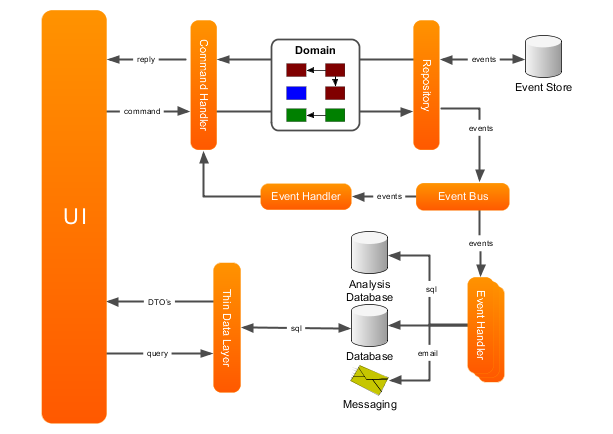
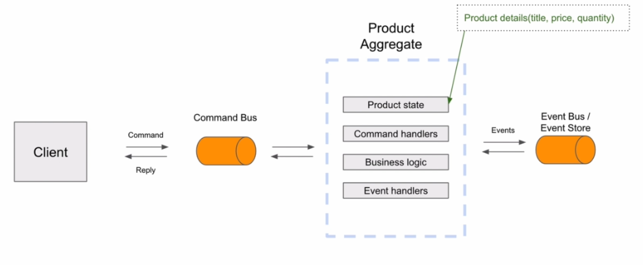

##Spinning up the project
###description
This is a microservice for handling product related logic

This microservice is powered by axon framework for handling event-sourcing within the microservice



This is the general architecture of axon you can find it in the docs of the site

# Overview of how the api works
## CQRS implementation
> `CommandGateway` and `QueryGateway` implementation within axon
> helps us implement the pattern of cqrs
### Command
#### Creating a product
>Summary: *Issue a command intent -> Create command handler -> 
> Aggregates the command by productID converts it into event and pushes it to event handler and persist it into the event store
> -> Create EventHandler -> pushes the record into the main entity*
> 
> Note: *An interceptor was created to query the cache before persisting the event* 
- in order to create a product of `{'title':''product name','price':200,'Quantity':2}`

- We create a command object that is going to be aggregated in a command handler then translated to an event object after the aggregate has been persisted


- Now in order to validate the data we before persisting the event we can add an interceptor after the command bus to handle validation
```
    @Autowired
    public void registerCreateProductCommandInterceptor(
            ApplicationContext context,
            CommandBus commandBus) {
        commandBus.registerDispatchInterceptor(
                context.getBean(CreateProductCommandInterceptor.class));
    }
```
This way you can even add a lookup table to the interceptor and instead of sending it to the event bus to handle you can directly ask the table if it already has that value

- You can also use `spring-boot-starter-validation` for validating the schema of the received json
```
    public String createProduct(@Valid @RequestBody CreateProductRestModel createProductRestModel) {}
```
All you have to do is limit your schema and add @Valid decoration to your incoming RequestBody

## Receiving the event after it was aggregated
```
    @EventHandler
    public void on(ProductCreatedEvent event) {
        ProductEntity productEntity = new ProductEntity();
        BeanUtils.copyProperties(event, productEntity);
        productRepository.save(productEntity);
    }
```

The class is decorated with `@ProcessingGroup("product-group")` to hold the event handler withing a processing group that ensures sequential processing of the events and better handling for errors within that group

## Query
> Created a query intent class pushed it into the query gateway
> which the ProductQueryHandler received and returned the fetched 
> products from the database


# Error handling
### Three ways to go about this
- `ControllerAdvice` to get all exceptions to a certain class
- `EventExceptionHandler` from the interceptor class in the same file
- `ListienerInvocationErrorHandler` propagate the error from the event handler to the controller
```
    @Autowired
    public void configure(EventProcessingConfigurer config) {
```
```
        config.registerListenerInvocationErrorHandler("product-group",
                conf -> new ProductServiceEventErrorHandling());
```
or use this to propagate the error from the event handler to controller
```
        config.registerListenerInvocationErrorHandler("product-group",
                conf -> PropagatingErrorHandler.instance());
    }
```
